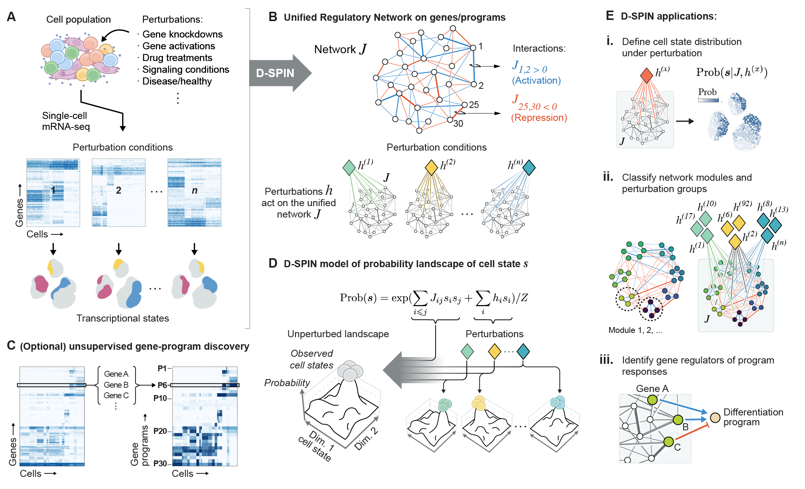
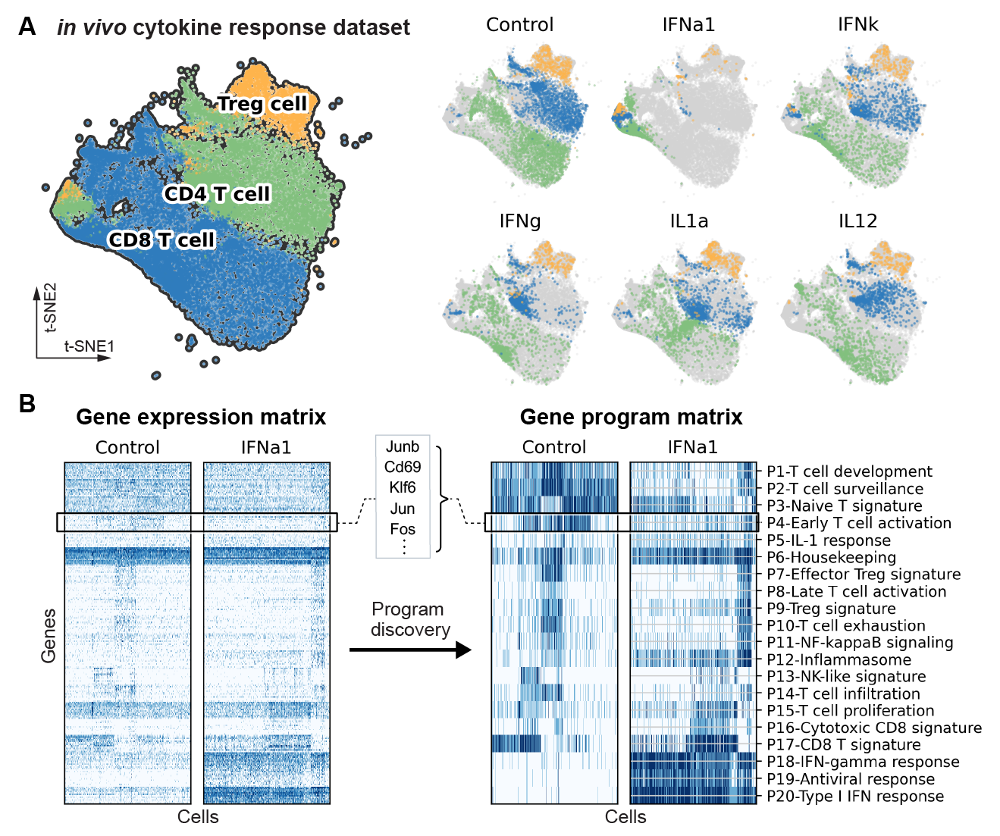
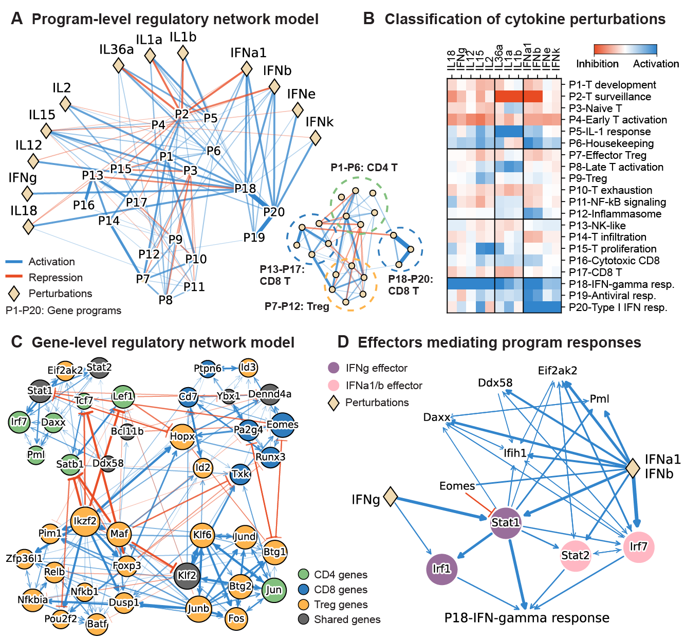

# DSPIN

Tutorial, code and examples of the D-SPIN framework for the preprint "D-SPIN constructs gene regulatory network models from multiplexed scRNA-seq data revealing organizing principles of cellular perturbation response" ([bioRxiv](https://www.biorxiv.org/content/10.1101/2023.04.19.537364))

<div align="center">
  
</div>

## Installation

D-SPIN is implemented in Python and MATLAB. The Python code is sufficient for the analysis of most datasets with less than 100k cells and a few hundreds of conditions. The MATLAB code is more efficient on large datasets as MATLAB can be easily deployed on clusters for parallelization with the build-in "parfor" function. 

The python code can be installed with 

`pip install dspin`

The MATLAB code can be downloaded from the folder "DSPIN_matlab", and directly executable in MATLAB after specifying the path to the data. 

## Demos

Two demos of D-SPIN are available on Google Colab. 

The first demo reconstructs the regulatory network of simulated hematopoietic stem cell (HSC) differentiation network with perturbations using the BEELINE framework (Pratapa, Aditya, et al. Nature methods, 2020). 

[Demo1](https://colab.research.google.com/drive/1Nja8AAcP0L7Ag6DGbyn21SxGafsYX4fA?usp=sharing)

The second demo reconstructs regulatory network and response vector in a public single-cell dataset of immune dictionary (Cui, Ang, et al. Nature, 2024), where mouse were treated with different cytokines and lymph nodes were than collected and profiled. 

[Demo2](https://colab.research.google.com/drive/1E8v4awQ-m4D02emG0jp6kmRDmkZ8hjjN?usp=sharing)

## Dependencies

DSPIN package was tested with the following python packages versions:

- python (3.9.18)
- anndata (0.10.3)
- matplotlib (3.8.2)
- scanpy (1.9.6)
- tqdm (4.65.0)
- leidenalg (0.10.1)
- igraph (0.10.8)

Note: other versions may work as well.

## Input data

D‑SPIN can work with many perturbation types **as long as they share the same core regulatory network**:

* **Genetic screens** – Perturb‑seq, CRISPR, RNAi  
* **Chemical or signaling cues** – drug treatments, growth‑factor changes  
* **Physiological differences** – healthy vs disease, different patients, time‑course samples  
* **Spatial niches** – local micro‑environments from spatial transcriptomics  

Because D‑SPIN models the *entire* distribution of transcriptional states, it expects **single‑cell RNA‑seq** data. Bulk data is possible but less informative.

#### AnnData requirements

* `adata.X` — log‑normalized (`log1p`) count matrix **after** QC: remove low‑quality cells, filter high mitochondrial content, keep highly variable genes.  
* `adata.obs['sample_id']` — condition label; cells with the same value form one perturbation group (≥ 25 cells per group is ideal).  
* `adata.obs['batch']` — batch identifier for cells processed together; D‑SPIN corrects batch effects by comparing conditions within each batch.  
* `adata.obs['if_control']` — `True` for controls, `False` otherwise; perturbation effects are measured relative to these controls (or to the overall average if no controls exist).  

## Building network models with D‑SPIN

#### Gene‑level network models

```python
from dspin.dspin import DSPIN

model = DSPIN(adata, save_path, num_spin=adata.shape[1])
model.network_inference(
    sample_id_key='sample_id',
    method='pseudo_likelihood',
    directed=True,
    run_with_matlab=False,
    params={'stepsz': 0.05, 'lam_l1_j': 0.01}
)
model.response_relative_to_control(
    sample_id_key='sample_id',
    if_control_key='if_control',
    batch_key='batch'
)
```

* **Results saved to `model`:**
  * `model.network` – regulatory weights **J**
  * `model.responses` – gene‑level responses **h**
  * `model.relative_responses` – responses relative to control (per batch)

* **Key options**
  * `num_spin=adata.shape[1]` → build a *gene‑level* network  
  * `directed=True` → only supported with `pseudo_likelihood`  
  * `run_with_matlab=True` → skip Python inference and write variables to `save_path` for the MATLAB version (speeds up very large data sets)  
  * `params` → hyper‑parameters such as step size, training epochs, and L1/L2 regularisation  

---

#### Program‑level network models

```python
from dspin.dspin import DSPIN

model = DSPIN(adata, save_path, num_spin=15)      # 15 gene programs
model.gene_program_discovery(
    num_repeat=10,
    seed=0,
    cluster_key='cell_type'                       # balance cell types
)
model.network_inference(
    sample_id_key='sample_id',
    method='mcmc_maximum_likelihood'
)
model.response_relative_to_control()
```

* **Extra outputs**
  * Gene‑program compositions in `save_path/onmf`
  * Consensus program gene lists in `save_path`

* **Tips**
  * Choose `num_spin` ≈ 5 × (number of cell types); keep ≤ 40  
  * `cluster_key` lets D‑SPIN down‑sample over‑represented cell types before oNMF  

---

#### Finding gene regulators of programs

```python
# model_program : program‑level DSPIN object
# model_gene    : gene‑level   DSPIN object
model_gene.program_regulator_discovery(
    model_program.program_representation,
    sample_id_key='sample_id',
    params={'stepsz': 0.02, 'lam_l1_interaction': 0.01}
)
```

* **Prerequisite** – `adata.obs` metadata must match between the two models so each cell’s gene and program states align.

* **Outputs in `model_gene`:**
  * `model_gene.program_interactions` – regression coefficients **J** (gene ↔ program)
  * `model_gene.program_activities` – global activity **h** for each program


## Application to the T cell population of the immune dictionary dataset


<div align="center">
  
</div>

<div align="left">
  <em>Figure&nbsp; Overview and program discovery for the immune dictionary dataset. (A) t-distributed stochastic neighbour (t-SNE) embedding for a subsetted cell population from the immune dictionary dataset \cite{cui2024dictionary}. The subset dataset includes CD4, CD8, and regulatory T cells treated by 12 different cytokines, as well as corresponding control samples treated by phosphate-buffered saline (PBS). 
(B) Heatmaps of gene expression and discretized gene program levels for control and IFN-$\alpha$1-treated samples. The gene programs are weighted averages of single-gene expressions that characterize and denoise the major expression pattern of the gene matrix.</em>
</div>

<div align="center">
  
</div>

<div align="left">
  <em>Figure&nbsp; Program/gene-level regulatory network inferred by D-SPIN.
(A) Diagram of D-SPIN-inferred network model on gene programs. The network is partitioned into 4 modules, each associated with a T cell type in the population.
(B) Heatmap of the program response of each cytokine. Clustering of the response partitioned the cytokines into 3 major categories. 
(C) Diagram of the core subnetwork of the D-SPIN-inferred gene network model. The node sizes scale with the number of identified interactions. The network is partitioned into 4 modules, each primarily composed of genes that have elevated expression in one specific T cell type.
(D) Interaction diagram for the subnetwork of IFN-$\alpha$1/IFN-$\beta$ and IFN-$\gamma$ acting on the program P18-IFN-$\gamma$ response. D-SPIN model shows that Type I and Type II interferons have different effectors to activate the program.</em>
</div>

## References

1. Jiang, Jialong, et al. "D-SPIN constructs gene regulatory network models from multiplexed scRNA-seq data revealing organizing principles of cellular perturbation response." bioRxiv (2023).

2. Pratapa, Aditya, et al. "Benchmarking algorithms for gene regulatory network inference from single-cell transcriptomic data." Nature methods 17.2 (2020): 147-154.

3. Cui, Ang, et al. "Dictionary of immune responses to cytokines at single-cell resolution." Nature 625.7994 (2024): 377-384.
