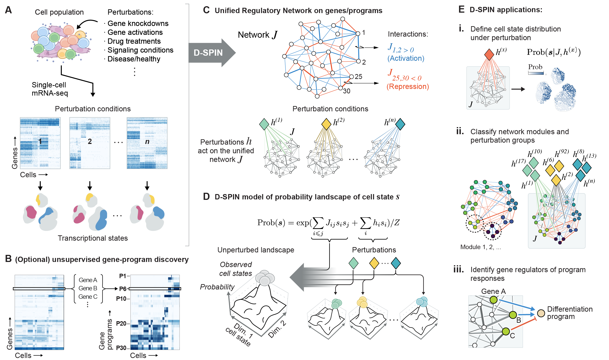
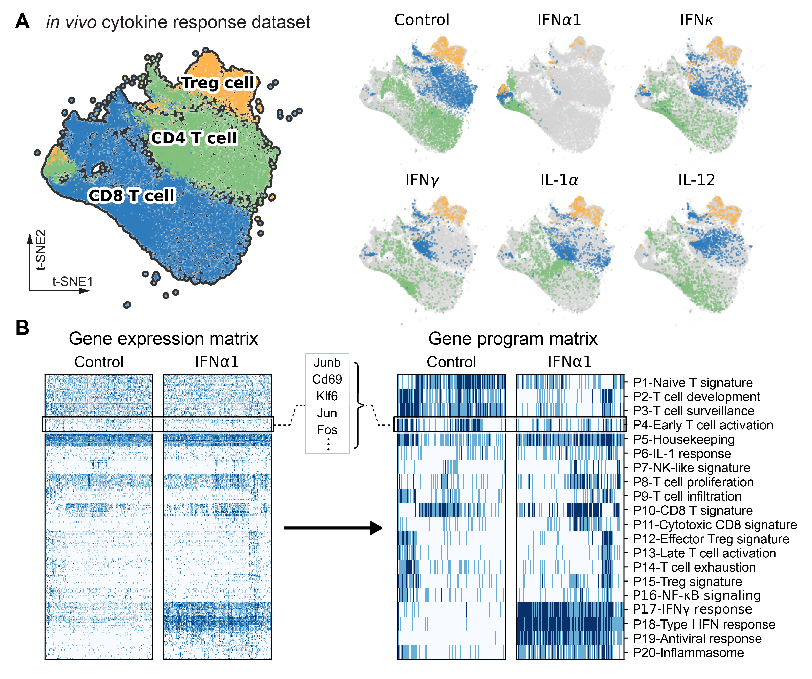
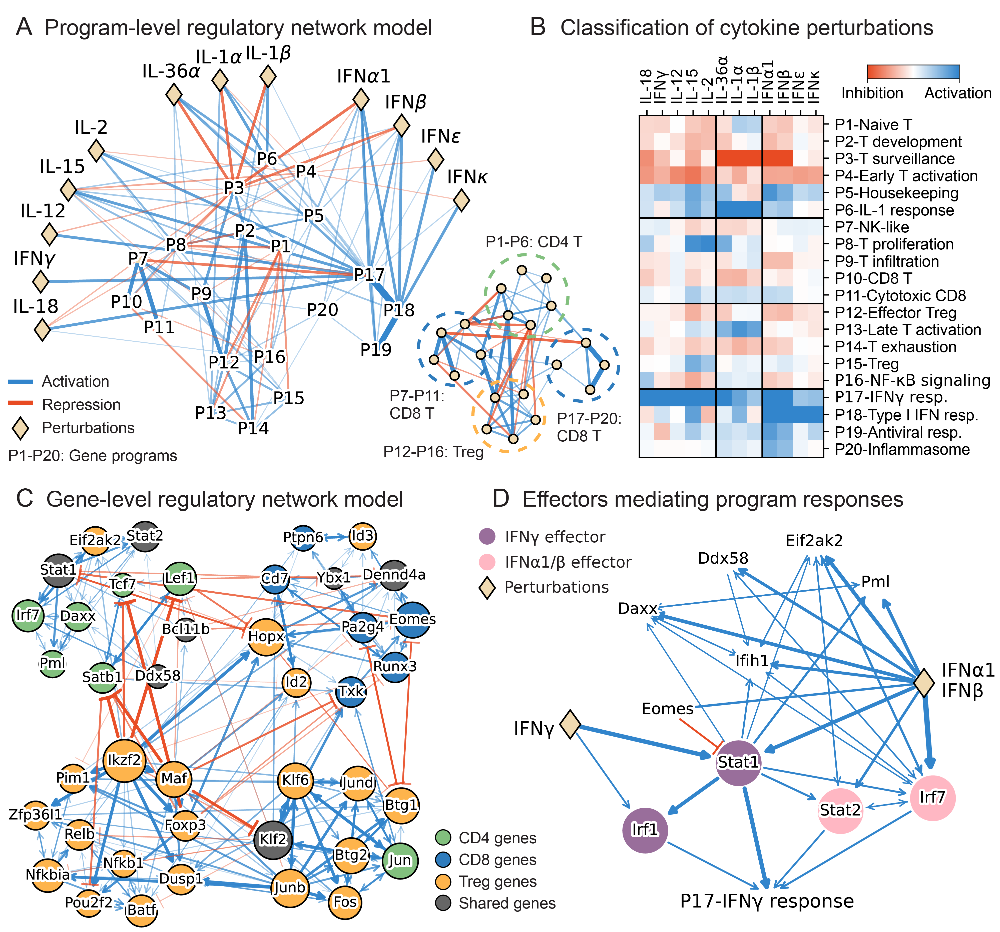

# DSPIN

Tutorial, code and examples of the D-SPIN framework for the preprint "D-SPIN constructs gene regulatory network models from multiplexed scRNA-seq data revealing organizing principles of cellular perturbation response" ([bioRxiv](https://www.biorxiv.org/content/10.1101/2023.04.19.537364))

<div align="center">
  
</div>

## Installation

D-SPIN is implemented in Python and MATLAB. The Python package is sufficient for most datasets with <100k cells and a few hundred conditions. The MATLAB implementation is more efficient on large datasets and can be deployed on clusters for parallelization using built-in `parfor`.

Install the Python package:

`pip install dspin`

The MATLAB code is available in the folder `DSPIN_matlab` and is executable after specifying paths to the saved data from the preprocessing with the Python package (see `run_with_matlab=True` below).

## Demos

A tutorial intended for an invited book chapter is available at bioRxiv:

[A guide to D-SPIN: constructing regulatory network models from single-cell RNA-seq perturbation data](https://www.biorxiv.org/content/10.1101/2025.07.28.667326.full).

Two demos of D-SPIN are available on Google Colab:

- **Demo1**: reconstructs a regulatory network from simulated hematopoietic stem cell (HSC) TF expression data under single-gene perturbations simulated with the BEELINE framework (Pratapa et al., *Nat. Methods*, 2020).  
  [Demo1](https://colab.research.google.com/drive/1Nja8AAcP0L7Ag6DGbyn21SxGafsYX4fA?usp=sharing)

- **Demo2**: reconstructs a regulatory network and response vectors using a subset of the immune dictionary dataset (Cui et al., *Nature*, 2024), where mice were treated with cytokines and lymph nodes were collected and profiled by scRNA-seq.  
  [Demo2](https://colab.research.google.com/drive/1E8v4awQ-m4D02emG0jp6kmRDmkZ8hjjN?usp=sharing)

## Dependencies

DSPIN was tested with:

- python (3.9.18)
- anndata (0.10.3)
- matplotlib (3.8.2)
- scanpy (1.9.6)
- tqdm (4.65.0)
- leidenalg (0.10.1)
- igraph (0.10.8)

Note: other versions may work as well.

## Input data

D-SPIN can work with many perturbation types under the assumption that the perturbation conditions share the same core regulatory network:

- **Genetic screens** – Perturb-seq, CRISPR knockdown/activation, RNAi  
- **Chemical or signaling cues** – drug treatments, growth-factor changes  
- **Physiological differences** – healthy vs disease, different patients, time courses  
- **Spatial niches** – local micro-environments from spatial transcriptomics  

Because D-SPIN models the *distribution* of transcriptional states, it is designed for **single-cell RNA-seq** data. The model can also work with bulk RNA-seq data but the performance is limited. 

### AnnData requirements

Minimum fields expected by the examples below:

- `adata.X` — log-normalized (`log1p`) matrix after QC (filter low-quality cells, high mitochondrial content, and typically use HVGs).  
- `adata.obs['sample_id']` — condition label; cells with the same value form one perturbation group.  
- `adata.obs['batch']` — batch label; perturbation effects are compared within each batch when controls exist.  
- `adata.obs['if_control']` — `True` for controls, `False` otherwise.  

Practical guidance:
- Aim for **≥ 25 cells per condition** when possible.
- If no explicit controls exist, D-SPIN can still compute responses relative to the global average, but matched controls per batch are preferred.

## Building network models with D-SPIN

### Gene-level network models

```python
from dspin.dspin import DSPIN

model = DSPIN(adata, save_path, num_spin=adata.shape[1])  # gene-level
model.network_inference(
    sample_id_key='sample_id',
    method='pseudo_likelihood',
    directed=True,
    # optional priors / constraints:
    # sample_list=None,
    # perturb_matrix=None,   # shape: (n_samples, n_genes)
    # prior_network=None,    # binary matrix of likely edges (e.g., motif/ATAC prior)
    run_with_matlab=False,
    params={'stepsz': 0.05, 'lam_l1_j': 0.01}
)
model.response_relative_to_control(
    sample_id_key='sample_id',
    if_control_key='if_control',
    batch_key='batch'
)
```

**Results saved to `model`:**
- `model.network` – regulatory weights **J**
- `model.responses` – responses **h** for each condition
- `model.relative_responses` – responses relative to control (preferably within each batch)

**Tips**
- `num_spin=adata.shape[1]` - gene-level network  
- `directed=True` - only supported with `pseudo_likelihood`  
- `prior_network` (optional) - prior knowledge on network edges (e.g., TF–motif binding, ATAC-seq data)  
- `perturb_matrix` (optional) - prior on direct perturbation targets (e.g., Perturb-seq)  
- `run_with_matlab=True` - write variables to `save_path` for MATLAB inference on large datasets  

---

### Program-level network models

Program-level models first discover gene programs (via consensus oNMF), then infer a network over programs.

```python
from dspin.dspin import DSPIN

model = DSPIN(adata, save_path, num_spin=20)      # e.g., 20 programs
model.gene_program_discovery(
    num_repeat=10,
    seed=0,
    cluster_key='cell_type'                       # optional: balance cell types
)
model.network_inference(
    sample_id_key='sample_id',
    method='mcmc_maximum_likelihood'
)
model.response_relative_to_control(
    sample_id_key='sample_id',
    if_control_key='if_control',
    batch_key='batch'
)
```

**Extra outputs**
- Program compositions under `save_path/onmf`
- Consensus program gene lists under `save_path`

**Tips**
- A practical heuristic is `num_spin` ≈ 5 × (number of major cell types/clusters), but keep `num_spin ≤ 40` for interpretability.
- `cluster_key` lets D-SPIN down-sample over-represented cell types before oNMF to reduce overfitting.

---

### Finding gene regulators of programs

Given a program-level model (`model_program`) and a gene-level model (`model_gene`), D-SPIN can regress program activities onto the gene network to nominate regulators.

```python
# model_program : program-level DSPIN object
# model_gene    : gene-level   DSPIN object
model_gene.program_regulator_discovery(
    model_program.program_representation,
    sample_id_key='sample_id',
    params={'stepsz': 0.02, 'lam_l1_interaction': 0.01}
)
```

**Outputs in `model_gene`:**
- `model_gene.program_interactions` – regression coefficients (gene ↔ program)
- `model_gene.program_activities` – global activity for each program

**Tips**
- The two models should be built from `adata` objects with matching `adata.obs` (so each cell aligns between gene- and program-level representations).

---

### Module discovery and visualization (optional)

The package includes helpers for module discovery (Leiden clustering) and plotting.

```python
import dspin.plot as dp

# Example: program-level network
G, j_filt = dp.create_undirected_network(
    model.network,
    node_names=spin_name,           # list of program (or gene) names
    thres_strength=0.05
)
module_list = dp.compute_modules(G, resolution=1, seed=0)

dp.plot_network_heatmap(j_filt, module_list, spin_name_list=spin_name)
dp.plot_network_diagram(
    j_filt, module_list,
    pos=None,
    directed=False,
    weight_thres=0.15,
    spin_name_list_short=spin_name_short
)
dp.plot_response_heatmap(
    model.relative_responses,
    module_list,
    spin_name_list=spin_name,
    sample_list=model.sample_list
)
```

**Tips**
- `resolution` controls Leiden module granularity (higher - smaller modules).
- For gene-level models, `spin_name` is typically gene names; for program-level models, use program labels or representative gene names.

## Application to the T cell population of the immune dictionary dataset

<div align="center">
  
</div>

<div align="left">
<b>Figure: Overview and program discovery for the immune dictionary dataset (Cui et al., Nature 2024).</b>
(A) t-SNE embedding for a subset of cell populations from the immune dictionary dataset. The subset dataset includes CD4, CD8, and regulatory T cells treated by 12 different cytokines, as well as corresponding control samples treated by phosphate-buffered saline (PBS). 
(B) Heatmaps of gene expression and discretized gene program levels for control and IFN-&alpha;1-treated samples. The gene programs are weighted averages of single-gene expressions that characterize and denoise the major expression pattern of the gene matrix.
</div>
<br>
<div align="center">
  
</div>

<div align="left">
<b>Figure: Program-level and gene-level regulatory network inferred by D-SPIN.</b>
(A) Diagram of D-SPIN-inferred network model on gene programs. The network is partitioned into 4 modules, each associated with a T cell type in the population.
(B) Heatmap of the program response of each cytokine. Clustering of the response partitions the cytokines into 3 major categories. 
(C) Diagram of the core subnetwork of the D-SPIN-inferred gene network model. The node sizes scale with the number of identified interactions. The network is partitioned into 4 modules, each primarily composed of genes that have elevated expression in one specific T cell type.
(D) Interaction diagram for the subnetwork of IFN-&alpha;1/IFN-&beta; and IFN-&gamma; acting on the program P18-IFN-&gamma; response. The D-SPIN model shows that Type I and Type II interferons have different effectors to activate the program.
</div>

## References

1. Jiang, Jialong, et al. "D-SPIN constructs gene regulatory network models from multiplexed scRNA-seq data revealing organizing principles of cellular perturbation response." bioRxiv (2023).

2. Jiang, Jialong, and Thomson, Matt. "A guide to D-SPIN: constructing regulatory network models from single-cell RNA-seq perturbation data." bioRxiv (2025).

3. Pratapa, Aditya, et al. "Benchmarking algorithms for gene regulatory network inference from single-cell transcriptomic data." Nature methods 17.2 (2020): 147-154.

4. Cui, Ang, et al. "Dictionary of immune responses to cytokines at single-cell resolution." Nature 625.7994 (2024): 377-384.
