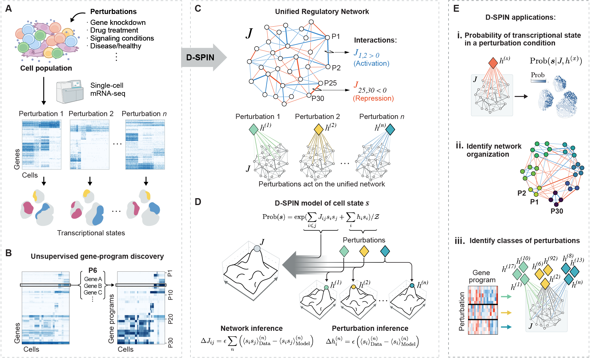
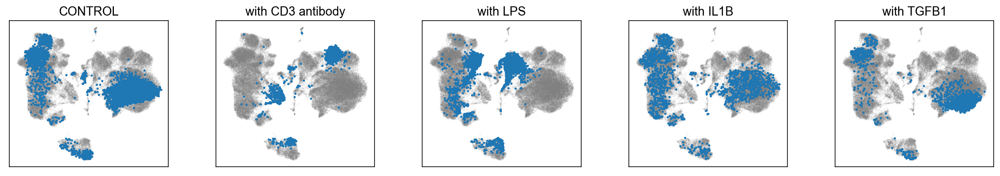
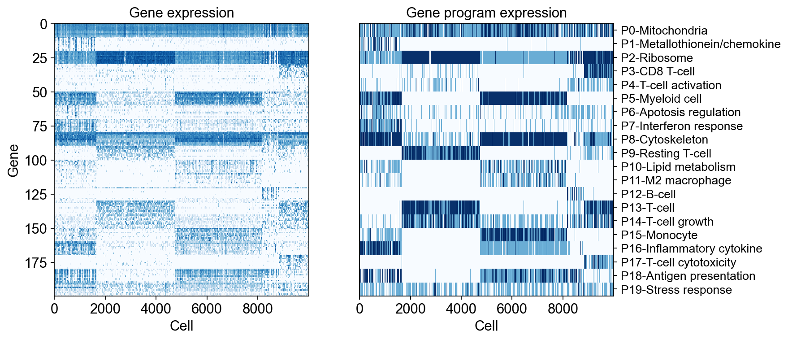
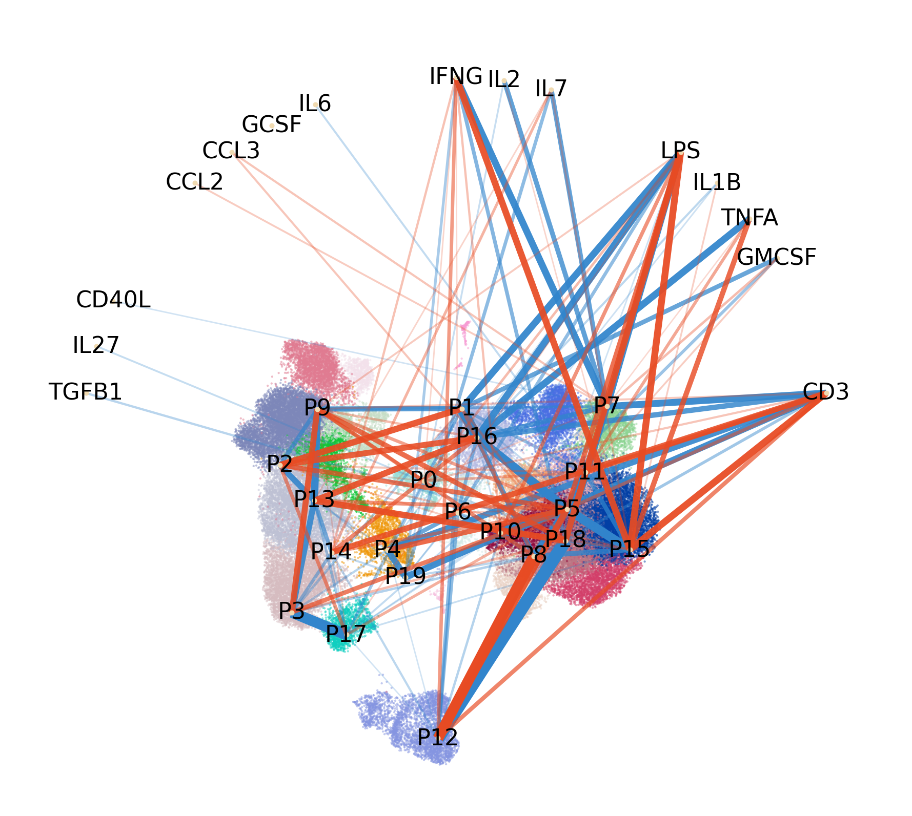

# DSPIN

Tutorial, code and examples of the D-SPIN framework for the preprint "D-SPIN constructs gene regulatory network models from multiplexed scRNA-seq data revealing organizing principles of cellular perturbation response" ([bioRxiv](https://www.biorxiv.org/content/10.1101/2023.04.19.537364))

## Installation

D-SPIN is implemented in Python and Matlab. The Python code is sufficient for analysis of small datasets with around 20k cells and tens of conditions. The Matlab code is only used for network inference on large datasets as Matlab can be easily deployed on clusters for parallelization with the build-in "parfor" function. 

The python code can be installed with 

`pip install dspin`

The Matlab code can be downloaded from the folder "DSPIN_matlab", and directly executable in Matlab after specifying the path to the data. 

## Demos

Two demos of D-SPIN are available on Google Colab. 

The first demo reconstructs the regulatory network of simulated hematopoietic stem cell (HSC) differentiation network with perturbations using the BEELINE framework (Pratapa, Aditya, et al. Nature methods, 2020). 

[Demo1](https://colab.research.google.com/drive/1mjJ09_E9kjEYsGCzf10-aZfuOqHUEV5u?usp=sharing)

The second demo reconstructs regulatory network and response vector in a single-cell dataset collected in the ThomsonLab.In the dataset, human peripheral blood mononuclear cells (PBMCs) were treated with various signaling molecules with different dosages. 

[Demo2](https://colab.research.google.com/drive/1U2WbmKvai3Y_-vlLV0SY1dv1LHdFjg2w?usp=sharing)

## Dependencies

DSPIN package was tested with the following python packages versions:

- python (3.9.18)
- anndata (0.10.3)
- matplotlib (3.8.2)
- scanpy (1.9.6)
- tqdm (4.65.0)
- leidenalg (0.10.1)
- igraph (0.10.8)

Note: other versions may work as well.

## D-SPIN Overview

D-SPIN contains three main steps: 
* Gene program discovery
* Network inference
* Network analysis

The input data should be AnnData object after typical single-cell preprocessing steps including cell counts normalization, log transformation, highly-varible gene selection, and clustering (optional). The input data should contain the following information. The attribute name is subject to the user while the following are defaults of the code:
* Normalized, log-transformed and filtered gene expression matrix in adata.X
* Sample information for each cell in adata.obs['sample_id']
* Batch information for each cell in adata.obs['batch']
* Clustering information for each cell in adata.obs['leiden']
* If some samples are control conditions, the relative response vectors will be computed for each batch with respect to the average of control conditions. The control conditions can be indicated in adata.obs['if_control'] with 1 for control and 0 for non-control. Note that all cells in the same sample and batch should have the same value in adata.obs['if_control'].

The D-SPIN is initiallized by model = dspin.DSPIN(adata) with the following major arguments:

* adata: AnnData object with the above information
* save_path: path to save the results
* num_spin (default 15): number of gene programs in the model
* filter_threshold (default 0.02): threshold for minimal proportion of cells that each gene program is expressed in

### Gene program discovery

By default, D-SPIN use orgthogonal non-negative matrix factorization (oNMF) to discover gene programs that coexpress in the data. The user can also specify pre-defined gene programs in full or partial. There are three senarios depending on the num_spin and the input parameter prior_programs.
* No pre-defined gene programs: empty prior_programs (default)
* Full pre-defined gene programs: the number of gene programs in prior_programs is equal to num_spin
* Partial pre-defined gene programs: the number of gene programs in prior_programs is less than num_spin

The gene program discovery contains two stages, the first stage subset and normalize the gene matrix, and the second stage run oNMF multiple times on the subset matrix to obtain consensus gene programs. Subsetting the gene matrix is primarily for computational efficiency, and preferrentially sampling cells with smaller population also helps to avoid overfitting on over-represented cell states in the dataset. As the algorithm for oNMF is stochastic, the algorithm is run multiples times and results from multiple run are combined to obtain a set of consensus gene program. Also, the number of oNMF components can be specified by the user to discover gene programs with finer resolution. For example, run the algorithm with 20 components in each individual run but combine the 20 programs into 15 consensus programs. 

Overall, in the gene program discovery function model.gene_program_discovery() , D-SPIN takes the following major arguments: 

* num_onmf_components (int, optional): The number of oNMF components. Default is infer based on num_spin and pre-assigned programs.
* num_subsample (int, optional): Number of cells to use in each individual oNMF components computation. Default is 10000.
* num_subsample_large (int, optional): Number of cells to use in computing consensus oNMF components. Default is 5 times of num_subsample.
* num_repeat (int, optional): Number of times to repeat the oNMF computation. Default is 10.
* balance_obs (str, optional): Cell type or clustering label in adata.obs for balanced sampling. Default is None.
* balance_method (str, optional): Method used for balancing. Options are 'squareroot', 'equal', 'proportional'. Default is 'squareroot'. 
* max_sample_rate (float, optional): Maximum oversampling rate for underrepresented cell type or clustering categories. Default is 2.
* prior_programs (List[List[str]], optional): List of pre-assigned gene programs. Default is None.
* summary_method (str, optional): Method used for computing sensus oNMF components. Options are 'kmeans' and 'leiden'. Default is 'kmeans'.

### Network inference

In the network inference step, D-SPIN automatically choose between three inference methods depending on the number of gene programs:

* Exact maximum-likelihood inference (MLE)
* Markov-Chain Monte-Carlo (MCMC) maximum-likelihood inference 
* Pseudo-likelihood inference (PL). 

MLE is exactly solution of the problem but only applies to small network. MCMC is slightly more scalable to networks with 20-40 nodes. PL takes more simplified approximation to the problem which scales to hundreds of nodes, but requires larger cell number for the approximation to be effective. in the gene program discovery function model.network_inference(), D-SPIN takes the following major arguments

* sample_col_name (str, optional): Column name in adata.obs for sample information. Default is 'sample_id'
* control_col_name (str, optional): Column name in adata.obs for whether the cell is in a control sample. If not provided, all cells are treated as non-control and relative response vector are the same as response vector.
* batch_col_name (str, optional): Column name in adata.obs for batch information. Relative response are computed by the control response vector in the same batch. If not provided, all cells are treated as one batch. 
* method (str, optional): Method used for network inference. Options are 'auto', 'maximum_likelihood', 'mcmc_maximum_likelihood', 'pseudo_likelihood'.
* example_list (List[str], optional): List of samples to use for network inference. Default is using all samples available in adata.obs[sample_col_name].
* record_step (int, optional): Number of steps to record training progress. Default is 10.
* params (Dict[str, Any], optional): Hypterparameters for the gradient descent of network inference. Default is None.

### Network analysis 

After network inference, D-SPIN provides three outputs:

* Inferred network adjacenty matrix in model.network 
* Inferred pertrubation response in model.response
* Relative perturbation response to control in model.relative_response

Typical downstream analysis includes network visualization, module identification, and graph clustering of perturbation response with the network. 

## Application to signaling response data of human PBMCs

D-SPIN takes single-cell sequencing data of multiple perturbation conditions. In the second demo, PBMCs are treated with different signaling molecules such as CD3 antibody, LPS, IL1B, and TGFB1

D-SPIN identifies a set of gene programs that coexpress in the data, and represent each cell as a combination of gene program expression states. 

D-SPIN uses cross-correlation and mean of each perturbation condition to inferred a unified regulatory network and the response vector of each perturbation condition. The inference can be parallelized across perturbation conditions. The inference code is in Matlab using "parfor", while for demo purpose Python code (without parallelization) is provided.

The inferred regulatory network and perturbations can be jointly analyzed to reveal how perturbations act in the context of the regulatory network.

## References

1. Jiang, Jialong, et al. "D-SPIN constructs gene regulatory network models from multiplexed scRNA-seq data revealing organizing principles of cellular perturbation response." bioRxiv (2023).

2. Pratapa, Aditya, et al. "Benchmarking algorithms for gene regulatory network inference from single-cell transcriptomic data." Nature methods 17.2 (2020): 147-154.
